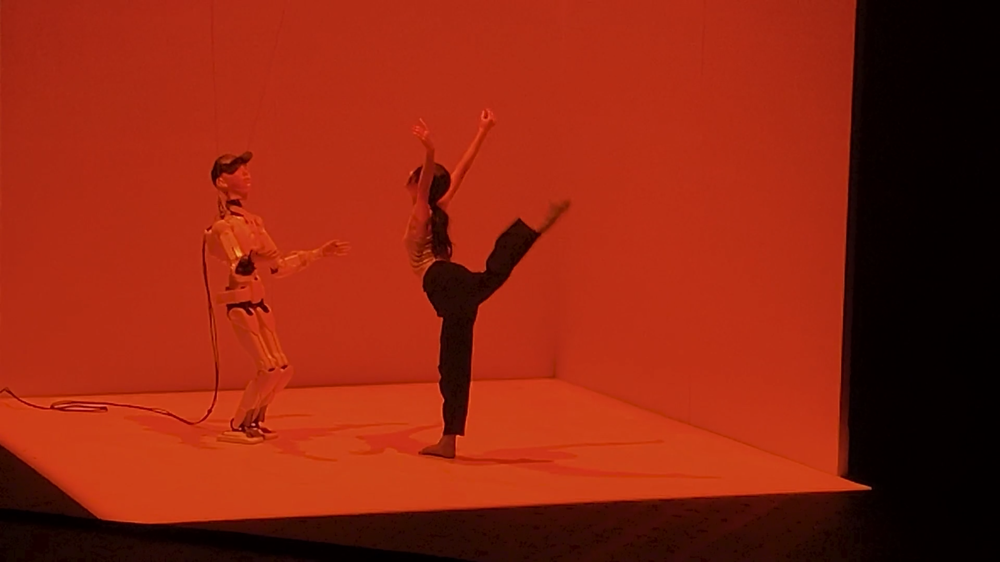
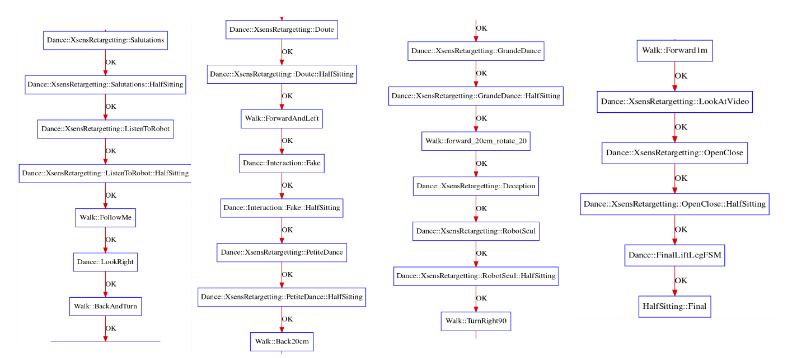

# CDADance

This controller publishes the controller's code used during the live demo held at Centre des Arts in September 2023.

**Live Demo**

[](https://vimeo.com/886474133)


**Control sceencast**
[](https://youtu.be/t7_CbzjKDQg)

## How to install

### Pre-requisites

- [mc_rtc](https://github.com/jrl-umi3218/mc_rtc)
- [lipm_walking_controller](https://github.com/jrl-umi3218/lipm_walking_controller)
- [mc_xsens_plugin](https://github.com/arntanguy/mc_xsens_plugin)
- [hrp4_description](https://github.com/isri-aist/hrp4_description)
- [mc-hrp4](https://github.com/isri-aist/mc-hrp4)
- [ismpc_walking]() [optional]
- PahoMqttCpp (optional, only required by the MosquittoPlugin for MQTT communication): `sudo apt install ros-noetic-paho-mqtt-cpp`

### Build and install

```sh
mkdir build
cd build
cmake -DCMAKE_BUILD_TYPE=RelWithDebInfo ..
make -8
sudo make install
```

### How to run

In your `mc_rtc.yaml` configuration file:

```yaml
MainRobot: HRP4::CDA
Enabled: CDADance
Timestep: 0.005
```

Then you can run in your favorite dynamic simulator (choreonoid, mujoco, ...)

### How does it work?

Here is the full demo FSM:



## Acknowledgements

- Artistic direction | Pr. Chu-Yin Chen
- Stage directer |  Rocio Berenguer
- Computer graphics | Isadora Teles de Castro
- Robot HRP-4 | Arnaud Tanguy, Hui-Ting Hong
- Performer | Hui-Ting Hong
- Sound | Isadora Teles de Castro
- Stage light | Carine GERARD

- Project CECCI-H2M, supported by EUR ArTeC

- Partners :
  - Labo. INREV-AIAC, Paris 8
  - CDA - Centre des Arts d’Enguien-les-Bains
  - LIRMM - Laboratoire d’informatique, de robotique et de microélectronique de Montpellier
